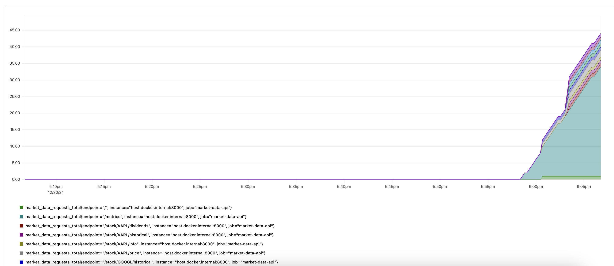

# Market Data API Observability Platform

A real-time observability platform that monitors and analyzes requests to the YFinance API. Built with FastAPI, Prometheus for metrics collection and querying, and Grafana dashboards for visualization. Each service runs in its own Docker container for easy deployment and scaling using [Docker Compose](https://docs.docker.com/compose/).

## Features
- Real-time and historical stock data via YFinance
- Prometheus metrics for monitoring API performance
- FastAPI backend with built-in API docs
- Grafana dashboards for data visualization
- Containerized architecture with Docker

## Current Implementation and Local Setup Instructions
### Running FastAPI and Prometheus Together
1. Start Docker Desktop
2. Navigate to the backend directory and run both services:
```bash
cd backend/
docker-compose up --build
```

You should see something like this:


The logs show both containers starting up successfully. Once they're running, the services will be available at:
- FastAPI: http://localhost:8000
- Prometheus: http://localhost:9090

### Creating API Traffic for Prometheus Metrics
I wrote a script to generate some traffic for the FastAPI service to hammer the YFinance API by sending a bunch of curl requests. [Run this locally after both containers are running](https://github.com/shahjacobb/Market-Data-API-Observability-Platform/blob/main/backend/endpoints_testing.sh)

Since both services are running, Prometheus will just automatically scrape the instrumented metrics from these requests at 5 second intervals.


### Working Endpoints
You can install jq first to pretty print format the JSON output:
```bash
brew install jq  # on macOS
```

Use uppercase tickers (AAPL not aapl) for all endpoints:

1. **Health Check**
```bash
curl http://localhost:8000/ | jq '.'
```

2. **Stock Price**
```bash
curl http://localhost:8000/stock/AAPL/price | jq '.'
```

3. **Historical Data**
```bash
# Default 1-month data
curl http://localhost:8000/stock/AAPL/historical | jq '.'

# Custom period and interval
curl "http://localhost:8000/stock/AAPL/historical?interval=1wk&period=1y" | jq '.'
```

4. **Company Info**
```bash
curl http://localhost:8000/stock/AAPL/info | jq '.'
```

5. **Dividends**
```bash
curl http://localhost:8000/stock/AAPL/dividends | jq '.'
```

6. **Earnings Data**
```bash
curl http://localhost:8000/stock/AAPL/earnings | jq '.'
```

### Testing Endpoints
First, let's test some requests:
```bash
curl http://localhost:8000/stock/AAPL/price | jq '.' && echo -e "\n" && curl http://localhost:8000/stock/MSFT/price | jq '.' && echo -e "\n" && curl http://localhost:8000/stock/GOOGL/historical | jq '.'
```

Response from endpoints:


Shows the price data for AAPL and MSFT, and historical data for GOOGL (with customizable time intervals).

### Metrics Implementation
FastAPI exposes these Prometheus metrics at `/metrics`:
- Request counts by endpoint
- Request latency measurements
- Stock symbol request frequency
- Stock price fetch latency
- Successful vs failed YFinance calls
- Number of unique symbols requested

### Using Prometheus
With our Docker containers running, you can start querying metrics using the Prometheus web UI at port 9090. Here's what we're tracking:

#### 1. API Traffic Patterns
Check requests across endpoints:
```promql
# Total requests by endpoint
market_data_requests_total
```

Total requests by endpoint:


The graph breaks down API usage - you can see the mix of price lookups, historical data pulls, and info requests.

#### 2. Stock Symbol Analytics
See which stocks are being queried:
```promql
# Requests per symbol
stock_symbol_requests_total
```

Request count by symbol:


Shows request volume per stock symbol over time (AAPL, GOOGL, MSFT).

### Development Status
#### Done
- [x] YFinance API Integration
  - [x] Real-time price endpoint
  - [x] Historical data endpoint
  - [x] Company info endpoint
  - [x] Dividend data endpoint
  - [x] Earnings data endpoint
- [x] docker
  - [x] FastAPI container
  - [x] Prometheus container
  - [x] Docker Compose setup
- [x] prometheus metrics
  - [x] Request counting
  - [x] Latency tracking
  - [x] Error monitoring
  - [x] yfinance call success rate

#### In Progress
**prometheus stuff**
- [ ] response status tracking
- [ ] yfinance error response details

**grafana**
- [ ] literally all of grafana

## Requirements
- Python 3.9 or newer
- Docker Desktop (for containerized deployment)

## License
MIT License - do whatever you want with this!
